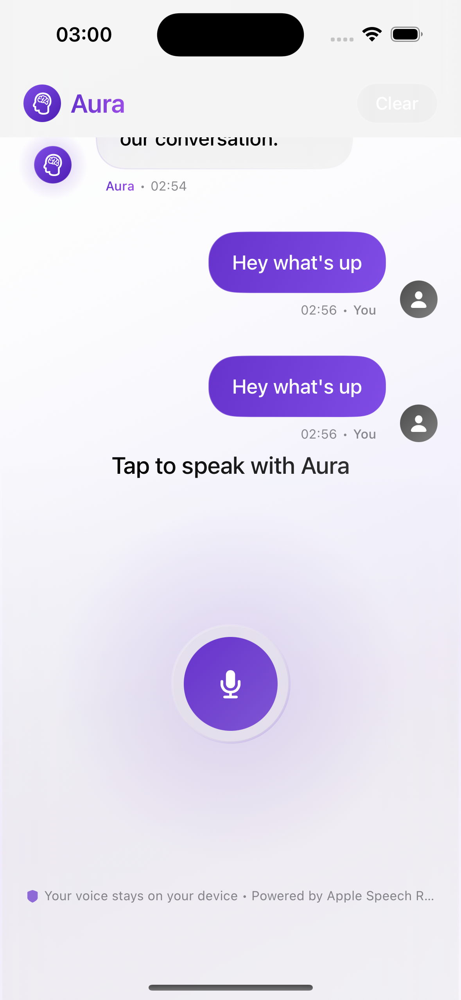

# Aura – AI Life Coach (Continuous Speech + Emotional Intelligence)

> Real-time, privacy-conscious AI life coach that listens continuously, tracks emotional trends, and surfaces deep behavioral patterns.

<p align="center">
   
</p>

## 🚀 Overview

Aura is a SwiftUI iOS application that acts as an always-on reflective companion. It continuously transcribes speech locally, periodically summarizes and analyzes what you say, extracts emotions every 30 seconds, and (on demand) performs a **Daily Pattern Analysis** to uncover repeating themes, emotional spikes, coping loops, and growth signals.

The experience is split into focused tabs:

- **My Aura** – Clean end‑user view: current emotional state + trend graph + primary listening control.
- **Chat** – Reflective therapy-style chat using recent transcript, emotional trend, and detected patterns for context (concise 2–4 sentence coaching turns).
- **Daily** – One‑off full‑day behavioral / emotional pattern mining with structured JSON parsing.
- **Debug** – Rich diagnostics: raw transcript flow, timers, manual triggers, internal states.
- **Settings** – Enable multiple speech recognition languages (English / Deutsch / Русский), pick a Primary, optional auto‑detect that switches when confidence is high.

## ✨ Core Features

| Category                     | Capability                                                             |
| ---------------------------- | ---------------------------------------------------------------------- |
| Continuous Listening         | Auto starts after permission; segments speech by silence & timing      |
| Adaptive Accumulation        | Bundles ~1 minute of meaningful speech before AI insight request       |
| AI Coaching Responses        | Structured conversation context → Theta EdgeCloud (Llama / similar)    |
| Emotional Snapshots          | Automatic + manual emotional analysis every 30s (Neutral fallback)     |
| Emotional Trend Graph        | Strava‑like area graph + emoji row & positivity baseline               |
| Daily Pattern Analysis       | One‑off transcript mining → patterns (title, summary, emoji, evidence) |
| Resilient Parsing            | Multi‑strategy emotion + JSON extraction w/ heuristic fallback         |
| Rate Limiting & Context Mgmt | Cooldown & trimmed rolling buffer (max messages)                       |
| Privacy‑Aware                | In-memory transcript only (no persistence yet)                         |
| Debug Utilities              | Test prompt, timers, diagnostics logging                               |
| Auto Language Detection      | NL language recognizer w/ confidence + cooldown switching              |

Legacy feature notes retained: earlier Whisper transcription approach evolved into a custom continuous speech pipeline; CBT‑style coaching retained in prompt persona.

## 🧠 Product Philosophy

Reduce friction in self‑reflection:

- Passive capture → active insight
- Lightweight emotional bio‑feedback
- Pattern surfacing for habit change
- Coaching tone: supportive, contextual, concise

## 🏗 Architecture

**Pattern:** MVVM + service layer.

```
AuraApp
   └── ContentView (TabView)
            ├── CleanAuraView      (consumer UI)
            ├── DailyAnalysisView  (full-day pattern mining)
            └── DebugView          (diagnostics + controls)

ChatViewModel (@MainActor)
   ├── ContinuousSpeechService  (streaming SFSpeechRecognizer orchestration)
   ├── ThetaAPIService          (conversation + one-off inference requests)
   ├── EmotionalAnalysisService (30s emotion snapshots)
   ├── ThetaEdgeAnalysisService (experimental periodic thematic analyzer)
   └── State: messages, accumulatedText, livePartial, emotionalTrend, dailyPatterns
```

### Key State Flows

1. **Speech → Accumulation:** `ContinuousSpeechService` builds `accumulatedText` while tracking silence, noise floor, confidence & session boundaries.
2. **Accumulation → AI Insight:** After interval / condition, `ChatViewModel` posts accumulated block via `ThetaAPIService.generateAIInsight()`; AI reply appended to chat.
3. **Emotional Polling:** 30s timer (plus manual trigger) calls `EmotionalAnalysisService.analyzeText()` on merged snapshot (accumulated + live partial). Result normalized → appended to `emotionalTrend`.
4. **Daily Pattern Mining:** User taps “Analyse my patterns” → `oneOffAnalysis()` with JSON-only prompt over truncated transcript (last 12k chars). Parsed → `[DailyPattern]`.

### Resilience & Safeguards

- Default Neutral emotion so UI never blank.
- Conversational requests rate-limited; daily analysis bypasses but updates timestamp.
- JSON parsing fallback if LLM returns prose.
- Context trimming & transcript truncation to prevent oversized payloads.

## 🔍 Notable Implementation Details

- **Swift Concurrency:** Async/await for network + emotion tasks; main actor state mutations.
- **Combine:** Service publishers (audio level, partial transcript) bridged into SwiftUI.
- **Graph Rendering:** Custom path + gradient + emoji row outside clipped chart.
- **Parsing Strategies:** Colon split, emoji scan, whitelist keywords for emotions; JSON substring or bullet heuristic for patterns.
- **Prompts:** Persona system prompt for coaching; dedicated minimal JSON extraction prompt for pattern analysis.
 - **Auto Language Detection:** Aggregates recent final utterances (≤6, ≥25 chars total) → `NLLanguageRecognizer`; switches primary language if mapped locale in enabled set (or auto-add), confidence ≥0.65, and ≥90s since prior switch.

## � Key Source Files

| File                             | Purpose                                  |
| -------------------------------- | ---------------------------------------- |
| `AuraApp.swift`                  | App entry & env loading                  |
| `ContentView.swift`              | Tab orchestration & major subviews       |
| `ChatViewModel.swift`            | Core orchestration & published state     |
| `ContinuousSpeechService.swift`  | Continuous speech recognition pipeline   |
| `ThetaAPIService.swift`          | Conversation + one-off analysis requests |
| `EmotionalAnalysisService.swift` | Emotional snapshot analyzer              |
| `ThetaEdgeAnalysisService.swift` | Experimental thematic analyzer           |
| `AudioService.swift`             | Legacy / alternative speech approach     |
| `ChatMessage.swift`              | Chat message model                       |
| `Config.swift`                   | Environment variable loader              |

## ⚙️ Configuration

Create a `.env` file (loaded at launch) with:

```
THETA_API_KEY=your_theta_edge_api_key_here
```

Ensure the key has access to the endpoints configured in `ThetaAPIService.baseURL`.

## ▶️ Running the App

1. Open `Aura.xcodeproj` in Xcode 15+.
2. Add your `.env` file (not committed).
3. Build & run on a physical device for best speech input.
4. Grant microphone & speech recognition permissions.
5. Speak naturally; observe emotional graph; run Daily analysis when ready.

## 💬 Usage Flow

1. Launch → permissions auto-check → continuous listening starts.
2. Speak freely; transcript accrues.
3. Aura periodically responds & updates emotion every 30s.
4. Open **Daily** tab for end-of-session pattern mining.

## 📊 Emotional Trend Scoring

Internal mapping (`score(for:)`) converts emotions → [-1, +1] for vertical placement.

## 🧩 Daily Pattern Output (Example)

```json
{
  "patterns": [
    {
      "title": "Evening Rumination",
      "summary": "You revisit unresolved work thoughts after 9pm, raising anxiety.",
      "emoji": "🌀",
      "evidence": "kept thinking about the project after dinner"
    }
  ]
}
```

Heuristic fallback: bullet-like lines if JSON parse fails.

## 🔐 Privacy

- Transcript in-memory only (session scope).
- No audio persistence. Only text context sent upstream.
- Future: optional local summarization + persistence encryption.

## � Roadmap

| Area                 | Idea                                                                     |
| -------------------- | ------------------------------------------------------------------------ |
| Persistence          | Secure storage of emotional trend & patterns                             |
| Personalization      | Adaptive emotion taxonomy, user mood tagging                             |
| UI                   | Tap-to-inspect graph points / pattern drill-down                         |
| Coaching Loop        | Action items & reminders                                                 |
| Privacy              | Edge summarization before cloud send                                     |
| Analytics            | Sentiment volatility, streak metrics                                     |
| Offline              | Local fallback model (basic emotion)                                     |
| Internationalization | Multi-language speech support (prototype language switching implemented) |

## 🧪 Testing Suggestions

- Mock `ThetaAPIService` to inject deterministic responses.
- Unit test emotion parsing permutations (colon / emoji / whitelist).
- Snapshot test `EmotionalTrendGraph` with synthetic data.

## ⚠️ Known Limitations

- No persistence (loss on restart).
- Transcript truncated for daily analysis (12k char suffix).
- Pattern extraction depends on LLM JSON compliance.
- Overlap between `AudioService` & `ContinuousSpeechService` (one could be retired).

## 🤝 Contributing

1. Fork & branch (`feature/my-improvement`).
2. Implement focused change (small PRs preferred).
3. Add minimal test or reproduction notes.
4. Submit PR with before/after behavior summary.

## 📄 License

Proprietary (add chosen license or convert to OSS later).

---

**Aura** turns passive speech into actionable emotional + behavioral insight. Speak. Observe. Adapt.
